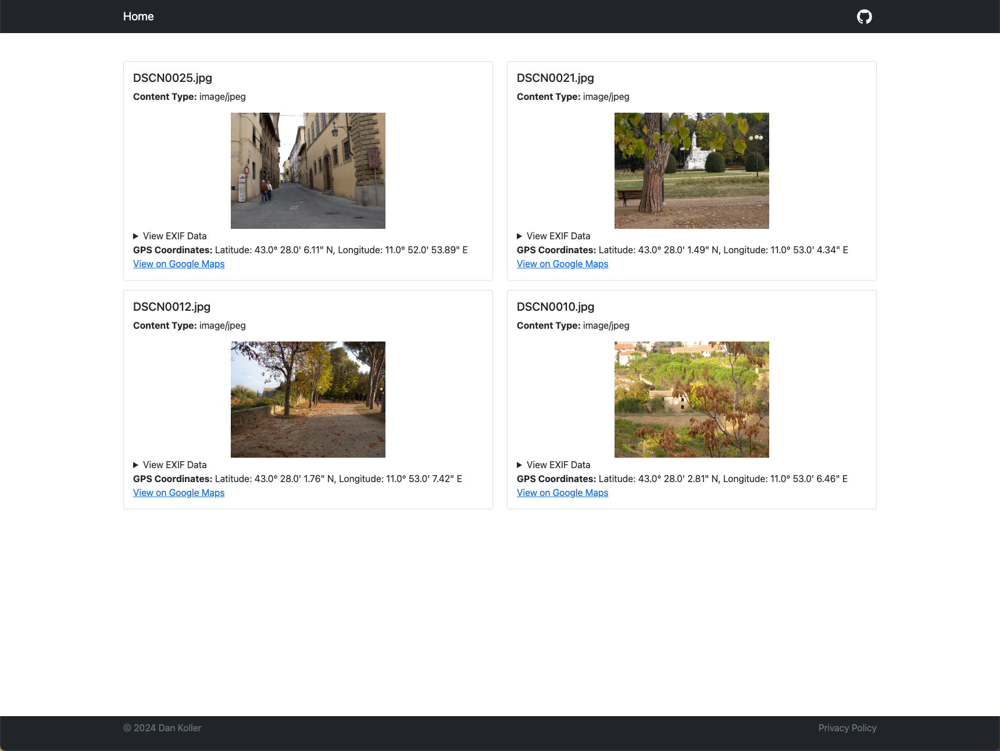

# ExifEx

[](https://www.python.org/downloads/release/python-3100/)
[](LICENSE)
[](https://github.com/dan-koller/exifex/actions/workflows/python-app.yml)

ExifEx is a small utility tool to extract EXIF metadata from images. It is written in Python and Flask and uses the Pillow library to read the images and retrieve the metadata.



_Example images taken from [this](https://github.com/ianare/exif-samples) repository._

## Features

-   🏞️ Extract EXIF metadata from images (_JPEG, PNG, TIFF, GIF, WebP, and more comming soon!_)
-   🕵️‍♀️ Display the metadata and GPS coordinates in a human-readable format
-   🌍 Generate a Google Maps link to the location where the image was taken (if available)
-   🗂️ Supports multiple images at once
-   🔒 No data is stored on the server

## Get started

Download the latest release from the [releases page](https://github.com/dan-koller/exifex/releases) and use the [setup.sh](setup.sh) (Mac & Linux) or [setup.bat](setup.bat) (Windows) script to set up the app via Docker or locally. For more detailed instructions, see the [installation guide](docs/INSTALLATION.md).

If you are already familiar with Git, you can use the commands below to clone the repository and run the setup script.

### Quickstart

To get the app up and running on Mac or Linux, run:

```bash
git clone https://github.com/dan-koller/exifex.git && cd exifex && chmod +x setup.sh && ./setup.sh
```

On Windows, open a command prompt (cmd) and run:

```cmd
git clone https://github.com/dan-koller/exifex.git && cd exifex && setup.bat
```

Follow the instructions in the terminal to start the app. By default, it will be available at [http://localhost:8080](http://localhost:8080).

### Usage

It's simple! Just drag and drop one or multiple images into the dropzone or click on it to select a file from your computer. The app will then display the extracted metadata and GPS coordinates (if available).

> **⚠️ Note**: Exif data can contain sensitive information, such as the location where the image was taken. Only analyze images you have the right to use.

## Contributing

If you want to contribute to the project, feel free to open an issue or a pull request. You can also suggest new features or improvements by [creating an issue](https://github.com/dan-koller/exifex/issues).

## License

This project is licensed under the MIT License. See the [LICENSE](LICENSE) file for more information.
