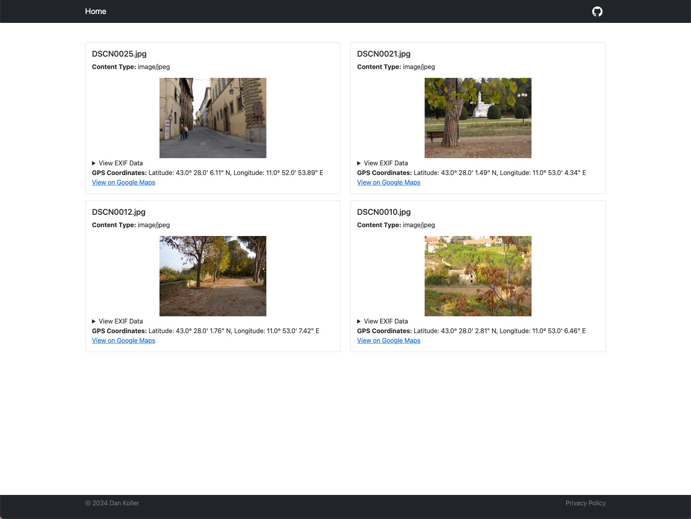

# ExifEx

ExifEx is a small utility tool to extract EXIF metadata from images. It is written in Python and Flask and uses the Pillow library to read the images and retrieve the metadata.

_Example images taken from [this](https://github.com/ianare/exif-samples) repository._

## Features

-   🏞️ Extract EXIF metadata from images (_JPEG, PNG, TIFF, GIF, WebP, and more comming soon!_)
-   🕵️‍♀️ Display the metadata and GPS coordinates in a human-readable format
-   🌍 Generate a Google Maps link to the location where the image was taken (if available)
-   🗂️ Supports multiple images at once
-   🔒 No data is stored on the server

## Get started

Use the [setup.sh](setup.sh) (Mac & Linux) or [setup.bat](setup.bat) (Windows) script to set up the app via Docker or locally or take a look at the [installation guide](docs/INSTALLATION.md) for more detailed instructions.

### Usage

It's simple! Just drag and drop one or multiple image file into the dropzone or click on it to select a file from your computer. The app will then display the extracted metadata and GPS coordinates (if available).

> **⚠️ Note**: Exif data can contain sensitive information, such as the location where the image was taken. Only analyze images you have the right to use.

## Contributing

If you want to contribute to the project, feel free to open an issue or a pull request. You can also suggest new features or improvements by creating an issue.

## License

This project is licensed under the MIT License. See the [LICENSE](LICENSE) file for more information.
